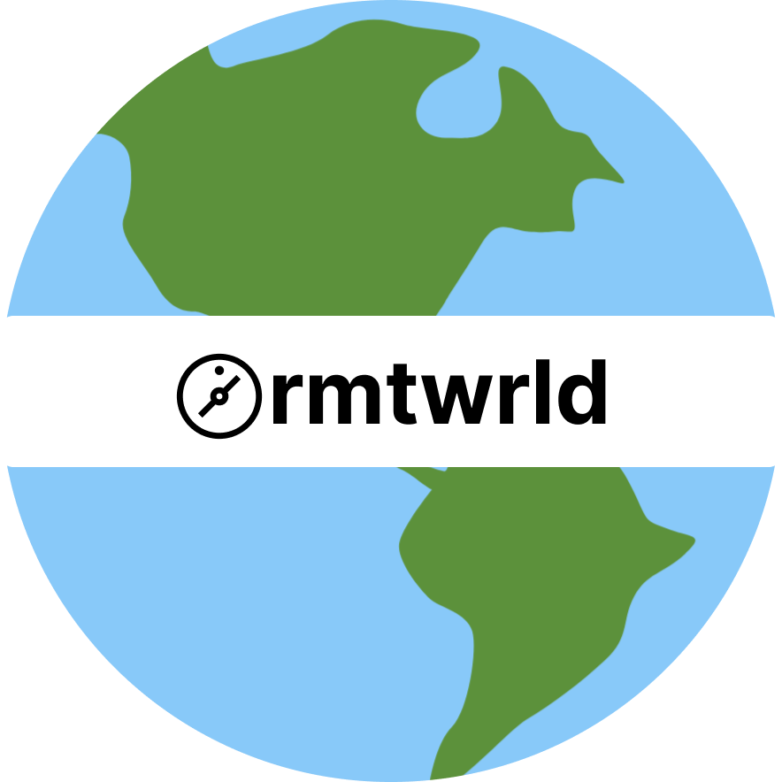

<div align="center">
  <a href="https://remoteworld.space">
    
  </a>
  <br />
  <p>
    <h3>
      <b>
        Remote World
      </b>
    </h3>
  </p>
  <p>
    <b>
      Find top cafes & coworking spaces to work
    </b>
  </p>
  <br />
</div>

### What is rmtwrld?
Remote world helps remote workers and digital nomads worldwide find cafés and workspaces.

### What can rmtworld be
The vision I hold for rmtwrld is to transform it into a product that impeccably caters to the diverse needs of digital nomads spanning the globe.

From effortlessly reserving seats at workspaces while on the move, to providing comprehensive nomad insurance, streamlining the hiring process, and fostering a cohesive global community that embarks on a collective journey. 
In my mind's eye, I foresee rmtworld's evolution into nothing short of an internet-based nation, revolutionizing the way nomads connect and thrive.

## Contributing
This product is developed using [django](https://www.djangoproject.com).
* [Install Python](https://www.python.org/downloads/)
* [Install Git](https://git-scm.com/downloads)
* [Install GitHub CLI](https://cli.github.com)
* [Install node.js](https://nodejs.org)

### Cloning the repository
```
gh repo clone thetronjohnson/remoteworld
```
  
### Setting up the virtual environment
Navigate to the repository and create a virtual environment
```
cd remoteworld
python -m venv .venv
```
Now activate the virtual environment
```
source .venv/bin/activate
```
Ensure that your python version is 3.10+
```
python --version
```
### Installing dependencies
```
pip install -r requirements.txt
```
#### Tailwind
This product uses [tailwind css](https://tailwindcss.com) & [daisyUI](https://daisyui.com/)
Ensure that you have node.js and npm installed
```
node -v
npm -v
```
To install the requirements run
```
npm install
```
### Configuring environments
You need to configure environment variables for to run the development server for that create a `.env` file in the root directory and copy the below content to it

```
DEBUG=True
```

### Running migrations
```
python manage.py migrate
```

### Running the server
```
python manage.py runserver
```

If you're working on the front end you need to generate CSS for tailwind so open a new terminal tab and run along with the django server
```
npx tailwindcss -i ./spaces/static/src/input.css -o ./spaces/static/src/output.css --watch
```


